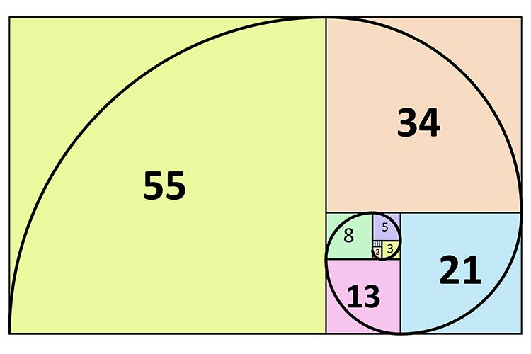

***Definition

The Fibonacci sequence is a series of numbers in which each number (known as a Fibonacci number) is the sum of the two preceding ones. The sequence typically starts with 0 and 1. The Fibonacci sequence can be defined recursively or iteratively. Here's a formal definition:

**Recursive Definition**:
- The Fibonacci sequence is defined recursively as follows:
  - Fibonacci(0) = 0
  - Fibonacci(1) = 1
  - Fibonacci(n) = Fibonacci(n-1) + Fibonacci(n-2) for n > 1

**Iterative Definition**:
- The Fibonacci sequence can also be defined as follows:
  - Start with the first two Fibonacci numbers: 0 and 1.
  - For each subsequent Fibonacci number, add the two previous Fibonacci numbers together.

The Fibonacci sequence begins as follows: 0, 1, 1, 2, 3, 5, 8, 13, 21, 34, ... and so on. Each number in the sequence (starting from the third number) is the sum of the two preceding numbers.

The Fibonacci sequence has numerous applications in various fields such as mathematics, computer science, biology, and finance. It appears in nature, architecture, and art, and its properties have fascinated mathematicians for centuries.

Take Quick view on Fibonacci using C++ [[FibonacciCode]].