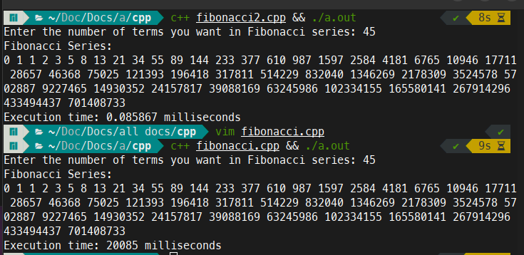

```#include <iostream>
#include <chrono>
#include <unordered_map>

// Function to calculate Fibonacci number recursively with memoization
std::unordered_map<int, int> memo;

int fibonacci(int n) {
    if (memo.find(n) != memo.end()) {
        return memo[n];
    }

    int result;
    if (n <= 1) {
        result = n;
    } else {
        result = fibonacci(n - 1) + fibonacci(n - 2);
    }

    memo[n] = result;
    return result;
}

int main() {
    int n;
    std::cout << "Enter the number of terms you want in Fibonacci series: ";
    std::cin >> n;

    auto start = std::chrono::steady_clock::now();

    std::cout << "Fibonacci Series:\n";
    for (int i = 0; i < n; ++i) {
        std::cout << fibonacci(i) << " ";
    }
    std::cout << std::endl;

    auto end = std::chrono::steady_clock::now();
    auto duration = std::chrono::duration_cast<std::chrono::milliseconds>(end - start);

    std::cout << "Execution time: " << duration.count() << " milliseconds" << std::endl;

    return 0;
}
```



Boom 
20085 / 0.085867 = 233908
Much faster.